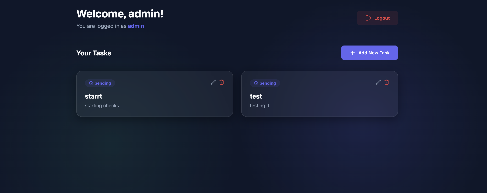
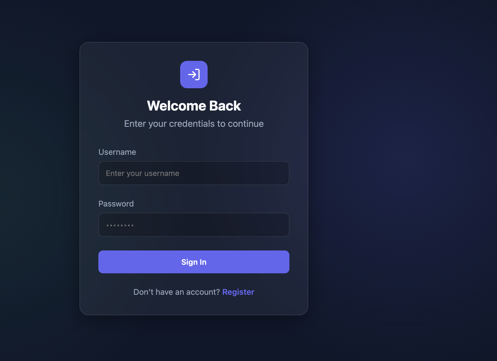
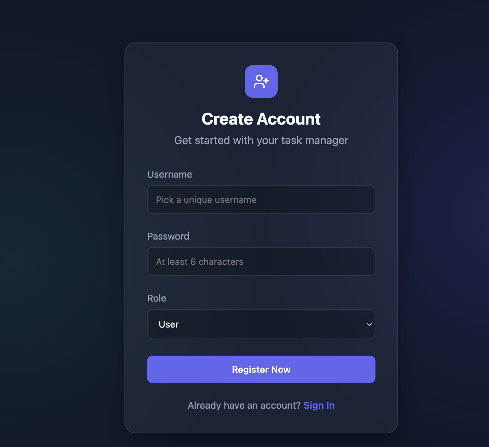

# Premium Full-Stack Auth & Task CRUD Application

A secure, performance-oriented full-stack web application featuring JWT-based authentication, role-based access control (RBAC), and a dynamic task management dashboard.

## 🚀 Technical Stack

- **Frontend**: React.js (Vite), Axios, Lucide Icons, Vanilla CSS (Glassmorphism design)
- **Backend**: Node.js, Express, MongoDB (Mongoose), JWT, Joi Validation

## 🖼️ Visual Preview

### Dashboard Overview


### Authentication Flow



### Interactive Demo


## 🛠️ Getting Started

### Prerequisites
- Node.js (v20+)
- MongoDB (running locally on port 27017)

### Local Setup

1. **Clone the repository**
2. **Backend Setup**:
   ```bash
   cd backend
   npm install
   npx nodemon app.js
   ```
   *The server will run on `http://localhost:5001`*

3. **Frontend Setup**:
   ```bash
   cd frontend
   npm install
   npm run dev
   ```
   *The app will run on `http://localhost:5173`*

## ⚙️ Production Deployment (systemd)

For production environments, it is recommended to manage the Node.js backend using **systemd**. 

### What systemd does:
- **Automatic Restarts**: If the backend crashes or the server reboots, systemd will automatically restart the service.
- **Background Processes**: Runs the application as a background daemon without needing an active terminal session.
- **Log Management**: Integrates with `journalctl` for centralized logging and rotating logs.
- **Resource Control**: Allows you to set limits on CPU and memory usage for the application.

*Example systemd service file (`/etc/systemd/system/node-app.service`):*
```ini
[Unit]
Description=Node.js Full-Stack Backend
After=network.target

[Service]
Type=simple
User=your-user
WorkingDirectory=/path/to/backend
ExecStart=/usr/bin/node app.js
Restart=on-failure

[Install]
WantedBy=multi-user.target
```

## 🔑 Authentication Flow

1. **Register**: Create an account with a username and password. Usernames allow alphanumeric characters and underscores.
2. **Login**: Authenticate to receive a JWT token, which is stored in LocalStorage.
3. **Authorized Requests**: A frontend Axios interceptor automatically attaches the JWT to the `Authorization` header for all task-related CRUD operations.

## 📡 API Endpoints

### Auth
- `POST /api/v1/auth/register` - Create new user
- `POST /api/v1/auth/login` - Authenticate and get token

### Tasks
- `GET /api/v1/tasks` - Get tasks (Admins see all, Users see their own)
- `POST /api/v1/tasks` - Create a new task
- `PUT /api/v1/tasks/:id` - Update an existing task
- `DELETE /api/v1/tasks/:id` - Remove a task

### Documentation
- `GET /api-docs` - View interactive Swagger documentation

---

## 📈 Scalability & Architecture Notes

This application is designed to scale from a monolithic MVP to a production-grade enterprise system.

### 1. Caching with Redis
- **Session Caching**: While using stateless JWTs is scalable, a Redis-backed "Deny List" or "Session Manager" can provide immediate logout capability and session invalidation.
- **Data Caching**: Implement Redis caching for the `GET /tasks` endpoint to reduce MongoDB read pressure for frequently accessed data.

### 2. Database Scaling
- **Replica Sets**: Deploy MongoDB with a Primary-Secondary-Arbiter setup to ensure high availability and read-scaling.
- **Sharding**: As the user base grows, partition data across multiple shards based on `userId` to distribute write load.

### 3. Microservices Migration
- **Auth Service**: Decouple User Registration and JWT logic into a dedicated service.
- **Task Service**: Isolate entity management into a microservice that communicates via gRPC or message queues (RabbitMQ/Kafka) for asynchronous processing (e.g., sending task reminders).

### 4. Load Balancing & Performance
- **Reverse Proxy**: Use Nginx or HAProxy to distribute traffic across multiple Node.js instances.
- **Node.js Cluster Mode**: Utilize the `cluster` module or `PM2` to leverage multi-core CPUs on a single server.
- **CDN**: Serve the frontend static assets via Cloudflare or AWS CloudFront to reduce latency.

### 5. Security Enhancements
- **Rate Limiting**: Implement `express-rate-limit` to prevent brute-force attacks on `/login` and `/register`.
- **Input Sanitization**: Use a deeper layer of sanitization (e.g., `helmetjs`) and CSRF protection for browser-based session security.
